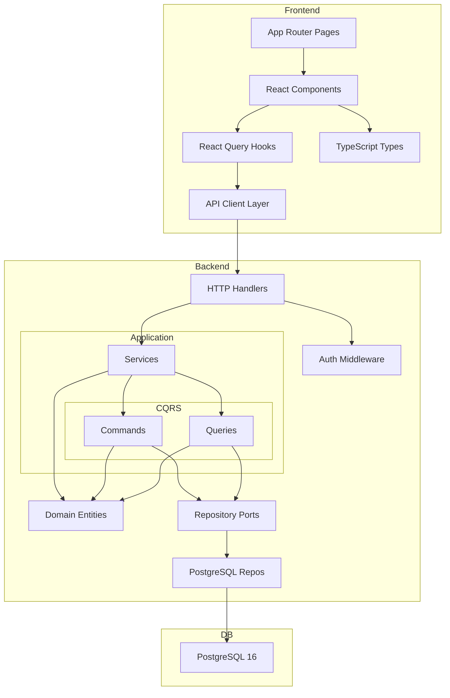

# Diagrama de Arquitectura - Nurse Portal

## Versión Detallada

```mermaid
flowchart TB
  %% Diagrama de Arquitectura - Nurse Portal

  subgraph Frontend["Frontend - Next.js / React"]
    subgraph Pages["Pages - App Router"]
      login["login"]
      planificaciones["planificaciones"]
      planificacionId["planificacion/[id]"]
      employees["employees"]
      employeeId["employees/[id]"]
      employeeNew["employees/new"]
      intercambio["intercambio"]
      intercambioNew["intercambio/new"]
      leaveRequests["leave-requests"]
      leaveRequestsNew["leave-requests/new"]
      schedules["schedules"]
      profile["profile"]
    end

    subgraph Components["Components"]
      appShell["AppShell"]
      planifComponents["Planificacion Components"]
      employeeComponents["Employee Components"]
      ausenciaComponents["Ausencia Components"]
      intercambioComponents["Intercambio Components"]
      uiPrimitives["UI Primitives - shadcn/ui"]
    end

    subgraph Features["Features - React Query Hooks"]
      useAuth["use-auth"]
      usePlanificaciones["use-planificaciones"]
      useEmployees["use-employees"]
      useAusencia["use-ausencia"]
      useIntercambio["use-intercambio"]
    end

    subgraph ApiLayer["API Client Layer"]
      apiClient["api/client.ts"]
      apiAuth["auth.ts"]
      apiEmployees["employees.ts"]
      apiPlanificaciones["planificaciones.ts"]
      apiAusencia["ausencia.ts"]
      apiIntercambio["intercambio.ts"]
    end

    Types["TypeScript Interfaces"]
  end

  subgraph Backend["Backend - Go Hexagonal"]
    subgraph HTTPAdapter["HTTP Adapter"]
      router["chi Router /api/v1"]
      authMiddleware["Auth Middleware"]
      authHandler["Auth Handler"]
      employeeHandler["Employee Handler"]
      planifHandler["Planificacion Handler"]
      ausenciaHandler["Ausencia Handler"]
      intercambioHandler["Intercambio Handler"]
    end

    subgraph Application["Application Layer"]
      subgraph Services["Services"]
        authService["Auth Service"]
        employeeService["Employee Service"]
        planifService["Planificacion Service"]
        ausenciaService["Ausencia Service"]
        intercambioService["Intercambio Service"]
      end

      subgraph Commands["Commands - CQRS"]
        cmdEmployee["Employee Commands"]
        cmdPlanif["Planificacion Commands"]
        cmdTurno["Turno Commands"]
        cmdLeave["Leave Commands"]
        cmdIntercambio["Intercambio Commands"]
        cmdCompensatory["Compensatory Commands"]
      end

      subgraph Queries["Queries - CQRS"]
        qryPlanif["Planificacion Queries"]
        qryLeave["Leave Queries"]
        qryIntercambio["Intercambio Queries"]
        qryCompensatory["Compensatory Queries"]
      end
    end

    subgraph Domain["Domain - Core"]
      domainEmployee["Employee"]
      domainPlanif["Planificacion"]
      domainTurno["Turno"]
      domainAusencia["Ausencia"]
      domainIntercambio["Intercambio"]
      domainAuth["Auth"]
    end

    Repos["Repository Interfaces"]

    subgraph PostgreSQLAdapter["PostgreSQL Adapter"]
      pgEmployee["Employee Repo"]
      pgPlanif["Planificacion Repo"]
      pgTurno["Turno Repo"]
      pgDotacion["Dotacion Repo"]
      pgLeave["Leave Repo"]
      pgCompensatory["Compensatory Repo"]
      pgIntercambio["Intercambio Repo"]
      pgAuth["Auth Repo"]
    end
  end

  Database["PostgreSQL 16"]

  login --> appShell
  planificaciones --> appShell
  planificacionId --> appShell
  employees --> appShell
  employeeId --> appShell
  employeeNew --> appShell
  intercambio --> appShell
  intercambioNew --> appShell
  leaveRequests --> appShell
  leaveRequestsNew --> appShell
  schedules --> appShell
  profile --> appShell

  appShell --> planifComponents
  appShell --> employeeComponents
  appShell --> ausenciaComponents
  appShell --> intercambioComponents
  appShell --> uiPrimitives

  planifComponents --> usePlanificaciones
  employeeComponents --> useEmployees
  ausenciaComponents --> useAusencia
  intercambioComponents --> useIntercambio
  appShell --> useAuth

  useAuth --> apiAuth
  usePlanificaciones --> apiPlanificaciones
  useEmployees --> apiEmployees
  useAusencia --> apiAusencia
  useIntercambio --> apiIntercambio

  apiAuth --> apiClient
  apiEmployees --> apiClient
  apiPlanificaciones --> apiClient
  apiAusencia --> apiClient
  apiIntercambio --> apiClient

  planifComponents --> Types
  employeeComponents --> Types
  ausenciaComponents --> Types
  intercambioComponents --> Types

  apiClient --> router
  router --> authMiddleware

  router --> authHandler
  router --> employeeHandler
  router --> planifHandler
  router --> ausenciaHandler
  router --> intercambioHandler

  authMiddleware --> authService
  authHandler --> authService
  employeeHandler --> employeeService
  planifHandler --> planifService
  ausenciaHandler --> ausenciaService
  intercambioHandler --> intercambioService

  authService --> domainAuth
  employeeService --> domainEmployee
  planifService --> domainPlanif
  planifService --> domainTurno
  ausenciaService --> domainAusencia
  intercambioService --> domainIntercambio

  employeeService --> cmdEmployee
  planifService --> cmdPlanif
  planifService --> cmdTurno
  ausenciaService --> cmdLeave
  ausenciaService --> cmdCompensatory
  intercambioService --> cmdIntercambio

  planifService --> qryPlanif
  ausenciaService --> qryLeave
  ausenciaService --> qryCompensatory
  intercambioService --> qryIntercambio

  cmdEmployee --> Repos
  cmdPlanif --> Repos
  cmdTurno --> Repos
  cmdLeave --> Repos
  cmdCompensatory --> Repos
  cmdIntercambio --> Repos
  qryPlanif --> Repos
  qryLeave --> Repos
  qryCompensatory --> Repos
  qryIntercambio --> Repos

  Repos --> pgEmployee
  Repos --> pgPlanif
  Repos --> pgTurno
  Repos --> pgDotacion
  Repos --> pgLeave
  Repos --> pgCompensatory
  Repos --> pgIntercambio
  Repos --> pgAuth

  pgEmployee --> Database
  pgPlanif --> Database
  pgTurno --> Database
  pgDotacion --> Database
  pgLeave --> Database
  pgCompensatory --> Database
  pgIntercambio --> Database
  pgAuth --> Database
```

## Versión Compacta

## Notas de implementación

### Planificaciones — Listado agrupado
- `PlanificacionService.List()` auto-cierra (`PUBLICADO → CERRADO`) planificaciones cuya semana ya venció antes de retornar la lista.
- El frontend (`planificacion-list.tsx`) clasifica las planificaciones en:
  - **Actual**: la de la semana vigente con `estado === PUBLICADO` (destacada como card principal).
  - **Próximas**: futuras dentro del próximo mes (collapsible, expandido por defecto).
  - **Recientes**: pasadas del último mes (collapsible, expandido por defecto).
  - **Anteriores**: el resto (collapsible, cerrado por defecto).
- Cada sección agrupa por mes usando `getMonthFromWeek()` de `lib/utils.ts`.
- `CollapsibleSection` (`components/ui/collapsible-section.tsx`) es un toggle reutilizable con icono chevron y contador.
- `isoWeekToDate()`, `getWeekRange()`, `getMonthFromWeek()` residen en `lib/utils.ts` (extraídas de componentes duplicados).
